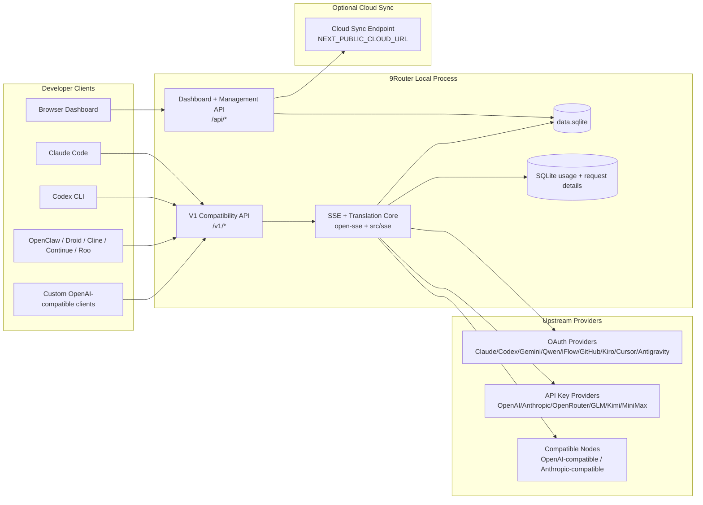
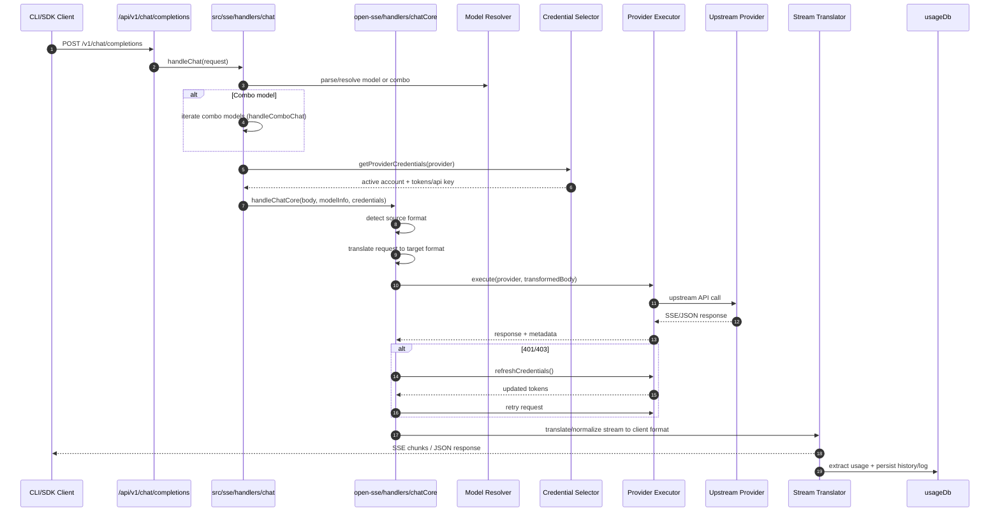
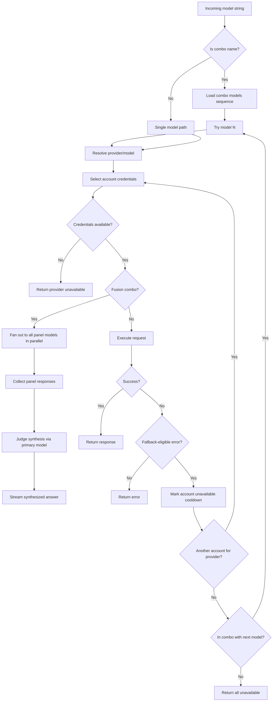
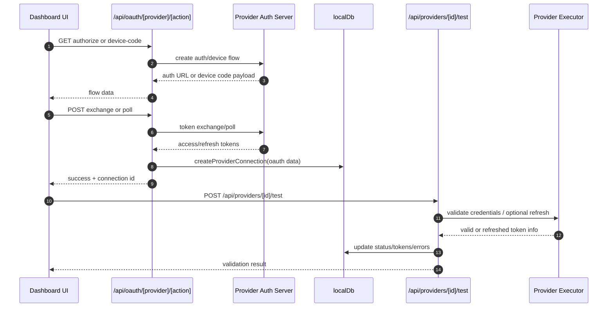
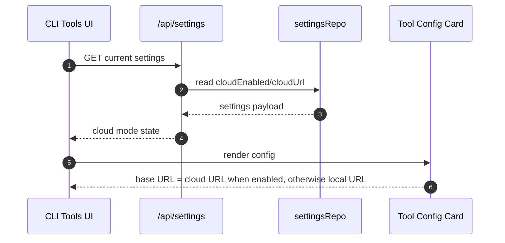
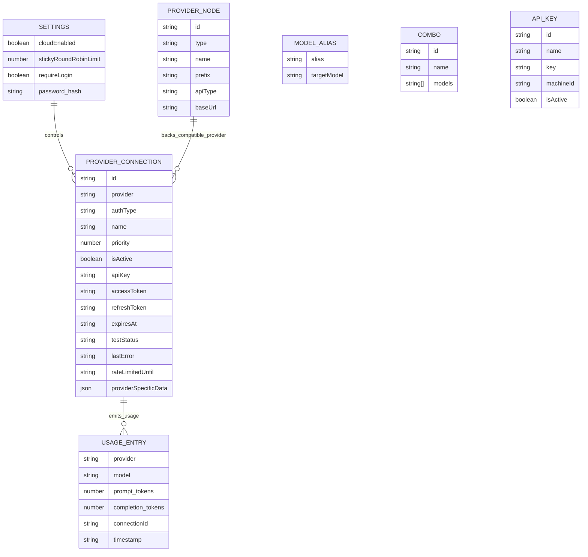
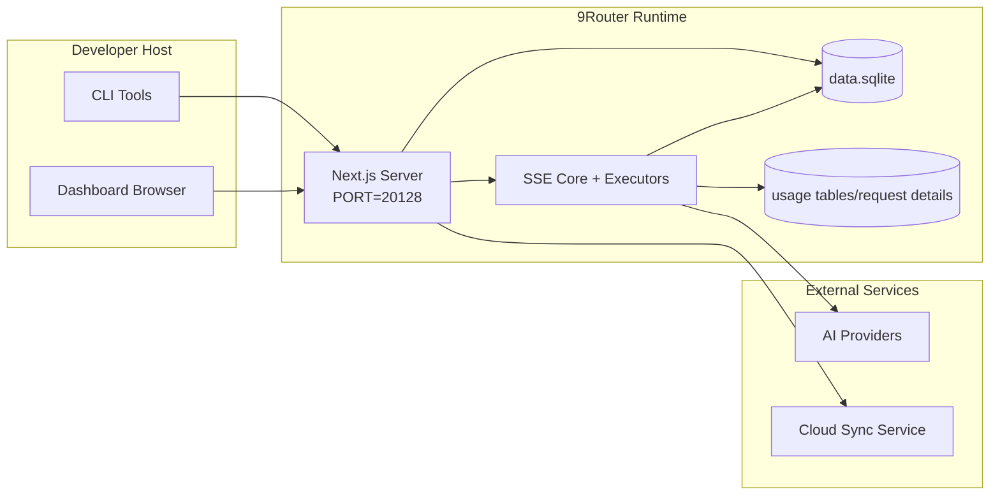

# 9Router Architecture

_Last updated: 2026-07-10_

## Executive Summary

9Router is a local AI routing gateway and dashboard built on Next.js.
It provides a single OpenAI-compatible endpoint (`/v1/*`) and routes traffic across multiple upstream providers with translation, fallback, token refresh, and usage tracking.

Core capabilities:

- OpenAI-compatible API surface for CLI/tools
- Request/response translation across provider formats
- Model combo fallback (multi-model sequence)
- Account-level fallback (multi-account per provider)
- OAuth + API-key provider connection management
- Local persistence for providers, keys, aliases, combos, settings, pricing
- Usage/cost tracking and redacted request logging
- Optional cloud sync for multi-device/state sync
- Deterministic Docker/source builds via lockfile-based installs, Dependabot coverage, and runtime smoke checks

Primary runtime model:

- Next.js app routes under `src/app/api/*` implement both dashboard APIs and compatibility APIs
- A shared SSE/routing core in `src/sse/*` + `open-sse/*` handles provider execution, translation, streaming, fallback, and usage

## Scope and Boundaries

### In Scope

- Local gateway runtime
- Dashboard management APIs
- Provider authentication and token refresh
- Request translation and SSE streaming
- Local state + usage persistence
- Optional cloud sync orchestration

### Out of Scope

- Cloud service implementation behind `NEXT_PUBLIC_CLOUD_URL`
- Provider SLA/control plane outside local process
- External CLI binaries themselves (Claude CLI, Codex CLI, etc.)

## High-Level System Context

## Core Runtime Components

## 1) API and Routing Layer (Next.js App Routes)

Main directories:

- `src/app/api/v1/*` and `src/app/api/v1beta/*` for compatibility APIs
- `src/app/api/*` for management/configuration APIs
- Next rewrites in `next.config.mjs` map `/v1/*` to `/api/v1/*`

Important compatibility routes:

- `src/app/api/v1/chat/completions/route.js`
- `src/app/api/v1/messages/route.js`
- `src/app/api/v1/responses/route.js`
- `src/app/api/v1/models/route.js`
- `src/app/api/v1/messages/count_tokens/route.js`
- `src/app/api/v1beta/models/route.js`
- `src/app/api/v1beta/models/[...path]/route.js`

Management domains:

- Auth/settings: `src/app/api/auth/*`, `src/app/api/settings/*`
- Providers/connections: `src/app/api/providers*`
- Provider nodes: `src/app/api/provider-nodes*`
- OAuth: `src/app/api/oauth/*`
- Keys/aliases/combos/pricing: `src/app/api/keys*`, `src/app/api/models/alias`, `src/app/api/combos*`, `src/app/api/pricing`
- Usage: `src/app/api/usage/*`
- Sync/cloud: `src/app/api/sync/*`, `src/app/api/cloud/*`
- CLI tooling helpers: `src/app/api/cli-tools/*`

## 2) SSE + Translation Core

Main flow modules:

- Entry: `src/sse/handlers/chat.js`
- Core orchestration: `open-sse/handlers/chatCore.js`
- Provider execution adapters: `open-sse/executors/*`
- Format detection/provider config: `open-sse/services/provider.js`
- Model parse/resolve: `src/sse/services/model.js`, `open-sse/services/model.js`
- Account fallback logic: `open-sse/services/accountFallback.js`
- Translation registry: `open-sse/translator/index.js`
- Stream transformations: `open-sse/utils/stream.js`, `open-sse/utils/streamHandler.js`
- Usage extraction/normalization: `open-sse/utils/usageTracking.js`

## 3) Persistence Layer

Primary state DB:

- `src/lib/localDb.js` is a compatibility shim over `src/lib/db/index.js`
- file: `${DATA_DIR}/db/data.sqlite`
- legacy import/migration paths are defined in `src/lib/db/paths.js`
- entities: providerConnections, providerNodes, modelAliases, combos, apiKeys, settings, pricing, usage, request details

Usage DB:

- `src/lib/usageDb.js` is a compatibility shim over the same SQLite DB layer
- usage stream reads from `src/lib/db` repositories through the shim and coalesces expensive stats refreshes per connection
- request/usage history is under `${DATA_DIR}/db/data.sqlite`; backups are under `${DATA_DIR}/db/backups/`

## 4) Auth + Security Surfaces

- Dashboard cookie auth: `src/proxy.js`, `src/app/api/auth/login/route.js`
- API key generation/verification: `src/shared/utils/apiKey.js`
- Provider secrets persisted in `providerConnections` entries
- Optional proxy support for upstream calls via env proxy variables (`open-sse/utils/proxyFetch.js`)
- **SSRF hardening (2026-06-19):**
  - Reverse proxy loopback bypass: `custom-server.js` stamps `x-9r-via-proxy` header; `src/dashboardGuard.js` rejects loopback-appearing requests when header is set
  - DNS rebinding protection: `open-sse/translator/helpers/imageHelper.js` resolves hostname once, pins to public IP, rejects redirects, enforces byte cap; blocked hosts list in `open-sse/config/mediaConfig.js`
  - AWS region injection (GHSA-6mwv-4mrm-5p3m): `src/lib/oauth/constants/oauth.js` exports `assertValidAwsRegion()`; called in all Kiro region-interpolating code paths
- **Kiro API-key auth (2026-06-19):** `POST /api/oauth/kiro/api-key` — headless auth without OAuth device flow; `src/lib/oauth/services/kiro.js` adds `validateApiKey()` and `listAvailableProfiles()`
- **Kiro IdC regional routing (2026-07-04):** `open-sse/executors/kiro.js` overrides `buildUrl()` — IAM Identity Center (`authMethod: "idc"`) tokens route to `*.amazonaws.com` CodeWhisperer surface, regionalized from `credentials.region`. `claude-to-kiro.js` + `openai-to-kiro.js` extended to treat `idc`/`external_idp` as account-bound auth (no shared default ARN fallback).
- **Kiro Claude Sonnet 5 (2026-07-04):** `open-sse/providers/capabilities.js` adds `claude-sonnet-5` + 3 variants (thinking/agentic/thinking-agentic) with 1M context + adaptive thinking. `src/shared/constants/cliTools.js` adds Sonnet 5 to Kiro MITM defaultModels.

## 5) Cloud URL Configuration

- Cloud mode is represented in settings (`cloudEnabled`, `cloudUrl`) and resolved by `src/lib/db/repos/settingsRepo.js`.
- Dashboard CLI-tool cards use cloud/local base URL selection when rendering tool configuration.
- No local cloud sync scheduler or `/api/sync/cloud` route exists in the current codebase.

## Request Lifecycle (`/v1/chat/completions`)

## Combo + Account Fallback Flow

Fallback decisions are driven by `open-sse/services/accountFallback.js` using status codes and error-message heuristics.

**Fusion combo (2026-06-19):** `open-sse/services/combo.js` exports `handleFusionChat` — detects required capabilities (`detectRequiredCapabilities`), reorders panel by capability match (`reorderByCapabilities`), fans out to all models in parallel (`collectPanel`/`withTimeout`), flattens tool history to prevent 503 (`flattenToolHistory`), builds judge prompt (`buildJudgePrompt`), streams synthesized answer. Dispatched from `src/sse/handlers/chat.js` at both combo entry points.

## OAuth Onboarding and Token Refresh Lifecycle

Refresh during live traffic is executed inside `open-sse/handlers/chatCore.js` via executor `refreshCredentials()`.

## Cloud URL Selection

Cloud URL resolution prefers saved `settings.cloudUrl`, then `CLOUD_URL`, then `NEXT_PUBLIC_CLOUD_URL`.

## Data Model and Storage Map

Physical storage files:

- main state and usage/request history: `${DATA_DIR}/db/data.sqlite`
- automatic SQLite backups: `${DATA_DIR}/db/backups/`
- legacy JSON import paths: `${DATA_DIR}/db.json`, `${DATA_DIR}/usage.json`, `${DATA_DIR}/disabledModels.json`, `${DATA_DIR}/request-details.json`
- optional translator/request debug sessions: `<repo>/logs/...` when `ENABLE_REQUEST_LOGS=true`

## Deployment Topology

## Module Mapping (Decision-Critical)

### Route and API Modules

- `src/app/api/v1/*`, `src/app/api/v1beta/*`: compatibility APIs; selected high-traffic chat/Gemini routes use shared CORS allowlist helpers for public deployment hardening
- `src/app/api/providers*`: provider CRUD, validation, testing
- `src/app/api/provider-nodes*`: custom compatible node management
- `src/app/api/oauth/*`: OAuth/device-code flows
- `src/app/api/keys*`: local API key lifecycle
- `src/app/api/models/alias`: alias management
- `src/app/api/combos*`: fallback combo management
- `src/app/api/pricing`: pricing overrides for cost calculation
- `src/app/api/usage/*`: usage and logs APIs
- cloud mode is currently settings/UI-driven; no `src/app/api/sync/*` or `src/app/api/cloud/*` routes exist in the current codebase
- `src/app/api/cli-tools/*`: local CLI config writers/checkers

### Routing and Execution Core

- `src/sse/handlers/chat.js`: request parse, combo handling, account selection loop
- `open-sse/handlers/chatCore.js`: translation, executor dispatch, retry/refresh handling, stream setup
- `open-sse/executors/*`: provider-specific network and format behavior

### Translation Registry and Format Converters

- `open-sse/translator/index.js`: translator registry and orchestration; ESM static imports (no `require()`); Step 0 direct-route check bypasses OpenAI pivot when a `source:target` route is registered
- Request translators: `open-sse/translator/request/*`
- Response translators: `open-sse/translator/response/*`
- Format constants: `open-sse/translator/formats.js`
- **Direct CLAUDE↔KIRO routes (2026-06-19):** `open-sse/translator/request/claude-to-kiro.js` + `open-sse/translator/response/kiro-to-claude.js` — registered as direct routes, bypassing the CLAUDE→OPENAI→KIRO pivot for lower latency and correct tool/thinking handling
- **Cached token cost tracking (2026-07-04):** `open-sse/utils/usageTracking.js` adds `canonicalizeUsage()` (folds Claude `cache_read_input_tokens` / `cache_creation_input_tokens` into `prompt_tokens`) and `mergeUsage()` (field-wise max-merge for Anthropic split events). `claude-to-openai.js` captures cache fields from `message_start` so `message_delta` doesn't reset them. `pricing-utils.js` subtracts both `cachedTokens` + `cacheCreationTokens` from non-cached input to prevent double-charging. Dashboard stats (`usage-helpers.js`, `usage-stats.js`) surface `cachedTokens` across all dimensions.
- **ClinePass provider (2026-07-04):** New OAuth + API-key provider using Cline's OpenAI-compatible API. `open-sse/services/clinepassModels.js` — live `/v1/models` resolver filtering `cline-pass/*` models. `src/lib/oauth/providers.js` registers ClinePass with base64 token exchange (same as Cline). `open-sse/executors/default.js` `refreshCline()` now injects `workos:` prefix on access tokens. `src/app/api/v1/models/route.js` registers live resolver.
- **Xiaomi-tokenplan region selector (2026-07-04):** `open-sse/config/providers.js` adds `regions` array (sgp/cn/ams) + `defaultRegion`; `EditConnectionModal` generically renders a `<Select>` for any provider with `regions`. Validate route accepts HTTP 403 as valid for xiaomi-tokenplan (keys lack list permission). Multi-connection guard removed for compatible/embedding nodes.
- Translator concerns (DRY extractions): `open-sse/translator/concerns/thinking.js`, `thinkingUnified.js`, `paramSupport.js`, `usage.js`; schema enums: `open-sse/translator/schema/`
- Config-driven param stripping: `stripUnsupportedParams` in `paramSupport.js`, called by default/github executors; `ANTIGRAVITY_REQUEST_BLACKLIST` in `antigravity.js`

### Persistence

- `src/lib/localDb.js`: persistent config/state
- `src/lib/usageDb.js`: usage history and rolling request logs

## Provider Executor Coverage

Specialized executors:

- `antigravity`
- `gemini-cli`
- `github`
- `kiro`
- `codex`
- `cursor`
- `clinepass` (via `default.js` with `clineHeaders` hook + `workos:` token prefix)

Default executor path:

- all other providers (including compatible node providers) use `open-sse/executors/default.js`

## Format Translation Coverage

Detected source formats include:

- `openai`
- `openai-responses`
- `claude`
- `gemini`

Target formats include:

- OpenAI chat/Responses
- Claude
- Gemini/Gemini-CLI/Antigravity envelope
- Kiro
- Cursor

Translations are selected dynamically based on source payload shape and provider target format.

## Failure Modes and Resilience

## 1) Account/Provider Availability

- provider account cooldown on transient/rate/auth errors
- account fallback before failing request
- combo model fallback when current model/provider path is exhausted
- provider-node validation uses `AbortController` so timeout cancels the underlying fetch and reports timeout-specific validation errors

## 2) Token Expiry

- pre-check and refresh with retry for refreshable providers
- 401/403 retry after refresh attempt in core path

## 3) Stream Safety

- disconnect-aware stream controller
- translation stream with buffered partial-line parsing, end-of-stream flush, and `[DONE]` handling
- Gemini v1beta streaming transforms keep a text buffer so JSON `data:` lines split across chunks are not dropped
- usage stats SSE coalesces concurrent full refreshes to the latest pending update per connection
- image-provider polling helpers accept `AbortSignal` so long-running polling can stop on abort/disconnect where the route passes a signal
- usage estimation fallback when provider usage metadata is missing

## 4) Cloud URL Degradation

- local runtime continues when cloud URL settings are absent or unreachable
- CLI-tool configuration UI falls back to local base URL when cloud mode is not enabled

## 5) Data Integrity

- DB shape migration/repair for missing keys
- corrupt JSON reset safeguards for localDb and usageDb

## Observability and Operational Signals

Runtime visibility sources:

- console logs from `src/sse/utils/logger.js`
- per-request usage aggregates and request details in `${DATA_DIR}/db/data.sqlite`
- optional deep request/translation logs under `logs/` when `ENABLE_REQUEST_LOGS=true`
- request logging masks auth-like header, URL query, and nested body keys (`authorization`, `x-api-key`, `cookie`, `token`, `secret`, `key`, `password`) as `[REDACTED]`
- dashboard usage endpoints (`/api/usage/*`) for UI consumption
- **Claude 429 cooldown (2026-06-19):** `open-sse/services/usage/claude.js` tracks per-token 180s cooldown on 429 responses to avoid usage-poller spam
- **Claude auto-ping (2026-06-19):** `src/shared/services/claudeAutoPing.js` — 60s tick scheduler warms the 5h OAuth quota window after reset; opt-in per connection; started from `initializeApp.js`
- **Codex reset credits (2026-06-19):** `POST /api/usage/[connectionId]/codex-reset-credits` — consumes one Codex rate-limit reset credit (irreversible); `open-sse/services/usage/codex.js` exports `consumeCodexRateLimitResetCredit()`
- **Codex reset credit expiry (2026-07-04):** `GET /api/usage/[connectionId]/codex-reset-credits` — read-only fetch of credit inventory (status, grantedAt, expiresAt); `resolveClinepassModels()` in `open-sse/services/usage/codex.js`; Quota Tracker modal in `ProviderLimits` shows per-credit expiry.

## Security-Sensitive Boundaries

- JWT secret (`JWT_SECRET`) secures dashboard session cookie verification/signing
- Initial password fallback (`INITIAL_PASSWORD`, default `123456`) must be overridden in real deployments
- API key HMAC secret (`API_KEY_SECRET`) secures generated local API key format
- Provider secrets (API keys/tokens) are persisted in local DB and should be protected at filesystem level
- Cloud/local CLI-tool URLs rely on API key auth + machine id semantics when exposed beyond localhost
- `/api/version/shutdown` is CLI-token-only via the machine-bound `x-9r-cli-token`; browser JWT auth alone is intentionally insufficient
- Local-only host-secret/spawn-capable routes still require loopback browser auth or the same CLI token path

## Environment and Runtime Matrix

Environment variables actively used by code:

- App/auth: `JWT_SECRET`, `INITIAL_PASSWORD`
- Storage: `DATA_DIR`
- Security hashing: `API_KEY_SECRET`, `MACHINE_ID_SALT`
- Logging: `ENABLE_REQUEST_LOGS`
- Sync/cloud URLing: `NEXT_PUBLIC_BASE_URL`, `NEXT_PUBLIC_CLOUD_URL`
- Outbound proxy: `HTTP_PROXY`, `HTTPS_PROXY`, `ALL_PROXY`, `NO_PROXY` and lowercase variants
- Public API CORS allowlist: `CORS_ALLOWED_ORIGINS` or `ALLOWED_ORIGINS` as comma-separated origins; production without allowlist only permits loopback browser origins on routes using the shared helper
- Platform/runtime helpers (not app-specific config): `APPDATA`, `NODE_ENV`, `PORT`, `HOSTNAME`

## Release and Dependency Hygiene

- Root and CLI package lockfiles are expected to match their package manifests before build/release.
- Docker builds copy `package.json` plus `package-lock.json` and install with `npm ci` for reproducibility.
- Dependabot covers root npm, `cli`, `gitbook`, Docker, and GitHub Actions with conservative grouped updates.
- CLI build validation must not silently mutate root package metadata during ordinary builds.

## Known Architectural Notes

1. `/api/v1/route.js` returns a static model list and is not the main models source used by `/v1/models`.
2. Request logger still writes payload structure and non-sensitive values when enabled; treat log directory as sensitive even with redaction.
3. Cloud URL selection depends on correct `CLOUD_URL` / `NEXT_PUBLIC_CLOUD_URL` configuration and external endpoint reachability.
4. Accessibility behavior is implemented as additive UI semantics: shared modal focus management, icon labels, sortable table buttons, chart summaries, toast live regions, and reduced-motion guards.
5. **Translator direct-route registry (2026-06-19):** `translateRequest`/`translateResponse` check for a registered `source:target` direct route before falling back to the two-step OpenAI pivot. New direct routes must call `register()` in `translator/index.js`; the lazy-init Maps (`requestRegistry`, `responseRegistry`) are populated on first call via ESM static imports.
6. **Provider registry split deferred:** The upstream refactor splitting providers into `open-sse/providers/registry/{id}.js` (110+ files) and migrating to LiteLLM-style `kind` schema has been intentionally deferred. `m.kind || m.type` guards are applied where needed; full migration remains a separate tracked item due to CRITICAL blast radius.
7. **Fusion combo panel ordering:** `reorderByCapabilities` gracefully returns the original model list unchanged when the provider registry is unavailable (pre-registry-split state), so Fusion degrades safely to input order.

## Operational Verification Checklist

- Build from source: `npm run build`
- Build Docker image: `docker build -t 9router .`
- Start service and verify:
- `GET /api/settings`
- `GET /api/v1/models`
- CLI target base URL should be `http://<host>:20128/v1` when `PORT=20128`
